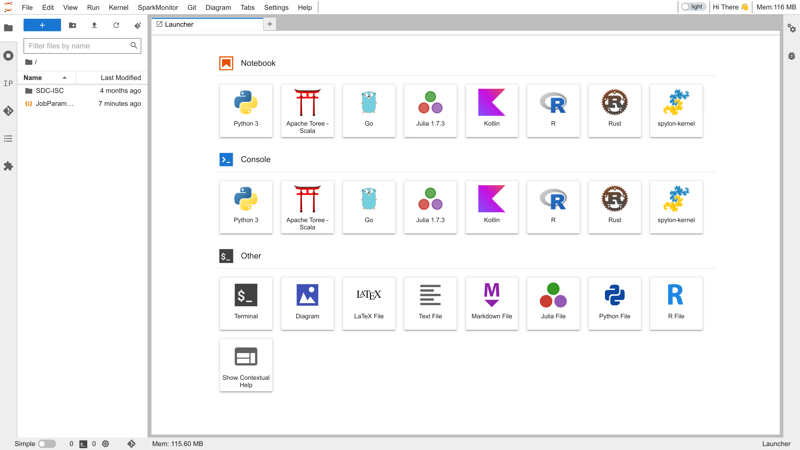
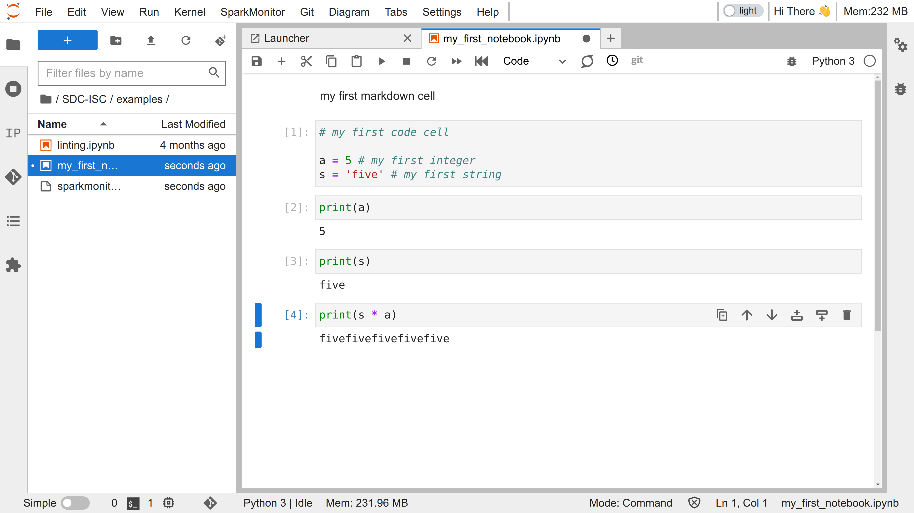

# Lesson 1:  Introduction to the computing platform _and_  basic computations in Python #

## Lesson 1.1: Jupyter - the computing platform ##

### Learning outcomes ###

1. name the components of the web-based interactive computing platform Jupyter
2. navigate and explain file paths
3. compress and uncompress archive file format such as ZIP

### The Notebook Interface ###

The Jupyter Notebook interface is a open source web-based application for writing documents that combine live-code with narrative text, equations and visualizations. You can watch a demo in video [LINK TO VIDEO HERE](link).


|  |
|:--:|
| *The JupyterLab launcher that allows you chose a specfic notebook kernel, console, and file type.* |

A Notebook consists of two types of cells: 

* Text Cells: Text cells allow you to write and render Markdown syntax. This is where you can describe and document your workflow.
* Code Cells: Code cells allow you to write and run programming code (ex. Python).

|  |
|:--:|
| *A notebook file in JupyterLab that consists of a set of cells. A cell can store text or code.* |


The JupyterLab notebook view offers several dropdown menus, most notably _File_ and _Kernel_. Under file you can open, close, save, and download files (ex. notebooks/.ipynb, Python/.py, Julia/.jl). A kernel is a computer program at the core of a computer’s operating system that has complete control over everything in the system. It is the “portion of the operating system code that is always resident in memory”, and facilitates interactions between hardware and software components. A notebook kernel is a 'computational engine' that executes the code contained in a Notebook.

JupyterLab has a modal user interface. This means that the keyboard does different things depending on which mode the Notebook is in. There are two modes: _edit mode_ and _command mode_.

Edit mode is indicated by a green cell border and a prompt showing in the editor area. When a cell is in edit mode, you can type into the cell, like a normal text editor. Enter edit mode by pressing `Enter` or using the mouse to click on a cell’s editor area.

Command mode is indicated by a grey cell border with a blue left margin. When you are in command mode, you are able to edit the notebook as a whole, but not type into individual cells. Most importantly, in command mode, the keyboard is mapped to a set of shortcuts that let you perform notebook and cell actions efficiently. For example, if you are in command mode and you press `c`, you will copy the current cell - no modifier is needed.

Enter command mode by pressing `Esc` or using the mouse to click outside a cell’s editor area.

The command icon palette (banner just above your notebook) provides you with short cuts for modifying, saving and running notebooks, ex. _Insert a cell below_ and _Run selected cells and advance_. JupyterLab also comes with a range of predefined short cut keys, ex. Shift+Enter to _Run selected cells and advance_. If you are on a Mac, substitute `command` for `control`. Don't type the _+_ (it means press both keys at once).

Shortcuts when in either _command mode_ (outside the cells) or _edit mode_ (inside a cell):
---
- `Shift` + `Enter` run selected cell or cells - if no cells below, insert a code cell below

- `Ctrl` + `B` toggle hide/show left sidebar

- `Ctrl` + `S` save and checkpoint
- `Ctrl` + `Shift` + `S` save as
- `Ctrl` + `F` find 

Shortcuts when in _command mode_ (outside the cells, no blinking cursor):
---
- `Enter` enter _edit mode_ in the active cell

- Scroll up with the up arrow 
- Scroll down with the down arrow

- `A` insert a new cell above the active cell
- `B` insert a new cell below the active cell

- `M` make the active cell a Markdown cell
- `Y` make the active cell a code cell

- `Shift` + `Up Arrow` select the current cell and the cell above
- `Shift` + `Down Arrow` select the current cell and the cell below
- `Ctrl` + `A` select all cells

- `X` cut the selected cell or cells
- `C` copy the selected cell or cells
- `V` paste the cell(s) which were copied or cut most recently

- `Shift + M` merge multiple selected cells into one cell

- `DD` (`D` twice) delete the active cell
- `00` (Zero twice) restart the kernel

- `Z` undo most recent command mode action

Shortcuts when in _edit mode_ (inside a cell with a blinking cursor):
---

- `Esc` enter _command mode_

- `Tab` code completion (or indent if at start of line)
- `Shift` + `Tab` tooltip help
- `Ctrl` + `Shift` + `-` split the active cell at the cursor

The usual commands for code editors:

- `Ctrl` + `]` indent
- `Ctrl` + `[` dedent

- `Ctrl` + `/` toggle comment

Plus the usual shortcuts for select all, cut, copy, paste, undo, etc.

## Lesson 1.2: File system ##

In order for Python/JupyterLab to use  to use certain files you need to direct it to where they can find them. This means, you need to know how to navigate your file system. Therefore it is important that you understand how your computer is organised.

The part of the operating system responsible for managing files and directories is called the _file system_. It organizes our data into files, which hold information, and directories (also called ‘folders’), which hold files or other directories.

Several commands are frequently used to create, inspect, rename, and delete files and directories. To start exploring them, we’ll go to a Terminal from the JypyterLab launcher.

First, let’s find out where we are by running a command called `pwd` (which stands for 'print working directory'). Directories are like places — at any time while we are using the shell, we are in exactly one place called our current working directory. Commands mostly read and write files in the current working directory, i.e. 'here', so knowing where you are before running a command is important. `pwd` shows you where you are:

```bash
$ pwd

/home/nelle
```

You can also get your working directory from via Python, but it requires you to import and use the `os` library (more about that later):

```py
>>> import os
>>> print(os.getcwd())

/home/nelle
```

Irrespective of the method, the computer's response is `/home/nelle`, which is Nelle's home directory

> **_Home Directory Variation:_**  The home directory path will look different on different operating systems. On Linux, it may look like `/home/nelle`, on Mac it will looks like `/Users/nelle`, and on Windows, it will be similar to `C:\Documents and Settings\nelle` or `C:\Users\nelle`. (Note that it may look slightly different for different versions of Windows.) In future examples, we’ve used Linux output as the default - Mac and Windows output may differ slightly but should be generally similar.We will also assume that your pwd command returns your user’s home directory. If `pwd` returns something different, you may need to navigate there using `cd` or some commands in this lesson will not work as written.

To understand what a 'home directory' is, let’s have a look at how the file system as a whole is organized. For the sake of this example, we’ll be illustrating the filesystem on our scientist Nelle's computer. After this illustration, you’ll be learning commands to explore your own filesystem, which will be constructed in a similar way, but not be exactly identical.

On Nelle’s computer, the filesystem looks like this:

```bash
/
├── bin
├── data
├── home
└── tmp
```

At the top is the root directory that holds everything else. We refer to it using a slash character, `/`, on its own; this character is the leading slash in `/home/nelle`.

Inside that directory are several other directories: `bin` (which is where some built-in programs are stored), `data` (for miscellaneous data files), `home` (where users’ personal directories are located), `tmp` (for temporary files that don’t need to be stored long-term), and so on.

We know that our current working directory `/home/nelle` is stored inside `/home` because `/home` is the first part of its name. Similarly, we know that `/home` is stored inside the root directory `/` because its name begins with `/`.

> **_Slaches:_** Notice that there are two meanings for the `/` character. When it appears at the front of a file or directory name, it refers to the root directory. When it appears _inside_ a path, it’s just a separator.

Underneath /home, we find one directory for each user with an account on Nelle’s machine, her colleagues imhotep and larry.

```bash
/
├── bin
├── data
├── home
│   ├── imhotep
│   ├── larry
│   └── nelle
└── tmp
```

The user  _imhotep_'s files are stored in `/home/imhotep`, user larry’s in `/home/larry`, and Nelle’s in `/home/nelle`. Because Nelle is the user in our examples here, therefore we get `/home/nelle` as our home directory. Typically, when you open a new command prompt, you will be in your home directory to start.

Now let's learn the command that will let us see the contents of our own filesystem. We can see what's in our home directory by running `ls`:

```bash
$ ls

Desktop  Documents  Downloads  Music  Pictures  Public  Videos
```

and with Python

```py
>>> import os
>>> print(os.listdir())

['Music', 'Desktop', 'Pictures', 'Downloads', 'Public', 'Videos', 'Documents']
```

(Again, your results may be slightly different depending on your operating system and how you have customized your filesystem.)

`ls` prints the names of the files and directories in the current directory. We can make its output more comprehensible by using the `-F` option which tells `ls` to _classify_ the output by adding a marker to file and directory names to indicate what they are:

a trailing `/` indicates that this is a directory
`@` indicates a link
`*` indicates an executable

Depending on your shell’s default settings, the shell might also use colors to indicate whether each entry is a file or directory.

```bash
$ ls -F

Desktop/  Documents/  Downloads/  Music/  Pictures/  Public/  Videos/
```

and with Python

```py
>>> import os
>>> os.system('ls -F')

Desktop/  Documents/  Downloads/  Music/  Pictures/  Public/  Videos/
```

Here, we can see that our home directory contains only _sub-directories_. Any names in our output that don't have a classification symbol are plain old _files_.

> **_Clearing your terminal:_** If your screen gets too cluttered, you can clear your terminal using the `clear` command. You can still access previous commands using `↑` and `↓` to move line-by-line, or by scrolling in your terminal.

### Exploring Other Directories ###

Not only can we use `ls` on the current working directory, but we can use it to list the contents of a different directory. Let's take a look at our `Desktop` directory by running `ls -F Desktop`, i.e., the command `ls` with the `-F` option and the argument `Desktop`. The argument `Desktop` tells `ls` that we want a listing of something other than our current working directory:

```bash
$ ls -F Desktop/

terminal-lesson-data/
```

Note that if a directory named `Desktop` does not exist in your current working directory, this command will return an error. Typically, a `Desktop` directory exists in your home directory, which we assume is the current working directory of your terminal.

As you may now see, using a terminal is strongly dependent on the idea that your files are organized in a hierarchical file system. Organizing things hierarchically in this way helps us keep track of our work: it's possible to put hundreds of files in our home directory, just as it's possible to pile hundreds of printed papers on our desk, but it’s a self-defeating strategy.

Now that we know the `terminal-lesson-data` directory is located in our `Desktop` directory, we can do two things.

First, we can look at its contents, using the same strategy as before, passing a directory name to `ls`:

```bash
$ ls -F Desktop/terminal-lesson-data/

exercise-data/  north-pacific-gyre/
```

Second, we can actually change our location to a different directory, so we are no longer located in our home directory.

The command to change locations is `cd` followed by a directory name to change our working directory. `cd` stands for 'change directory', which is a bit misleading: the command doesn't change the directory; it changes the shell's idea of what directory we are in. The `cd` command is akin to double-clicking a folder in a graphical interface to get into a folder.

Let's say we want to move to the `data` directory we saw above. We can use the following series of commands to get there:

```bash
$ cd Desktop
$ cd shell-lesson-data
$ cd exercise-data
```

These commands will move us from our home directory into our Desktop directory, then into the `shell-lesson-data` directory, then into the `exercise-data` directory. You will notice that `cd` doesn't print anything. This is normal. Many terminal commands will not output anything to the screen when successfully executed. But if we run `pwd` after it, we can see that we are now in `/home/nelle/Desktop/shell-lesson-data/exercise-data`.

If we run `ls -F` without arguments now, it lists the contents of `/home/nelle/Desktop/shell-lesson-data/exercise-data`, because that's where we now are:

```bash
$ pwd

/home/nelle/Desktop/shell-lesson-data/exercise-data

$ ls -F

animal-counts/  creatures/  numbers.txt  proteins/  writing/
```

We now know how to go down the directory tree (i.e. how to go into a subdirectory), but how do we go up (i.e. how do we leave a directory and go into its parent directory)? We might try the following:

```bash
$ cd shell-lesson-data

-bash: cd: shell-lesson-data: No such file or directory
```

But we get an error! Why is this?

With our methods so far, `cd` can only see sub-directories inside your current directory. There are different ways to see directories above your current location; we’ll start with the simplest.

There is a shortcut in the shell to move up one directory level that looks like this:

```bash
$ cd ..
$ pwd

/home/nelle/Desktop/terminal-lesson-data
```

The special directory `..` doesn't usually show up when we run `ls`. If we want to display it, we can add the `-a` option to `ls -F`:

```bash
$ ls -F -a

./  ../  exercise-data/  north-pacific-gyre/
```

`-a` stands for 'show all'; it forces ls to show us file and directory names that begin with `.`, such as `..` (which, if we're in /home/nelle, refers to the /home directory). As you can see, it also displays another special directory that's just called `.`, which means 'the current working directory'. It may seem redundant to have a name for it, but we’ll see some uses for it soon.

Note that in most command line tools, multiple options can be combined with a single - and no spaces between the options: `ls -F -a` is equivalent to `ls -Fa`.

> **_Other Hidden Files:_** In addition to the hidden directories `..` and `.`, you may also see a file called `.bash_profile`. This file usually contains shell configuration settings. You may also see other files and directories beginning with `..` These are usually files and directories that are used to configure different programs on your computer. The prefix `.` is used to prevent these configuration files from cluttering the terminal when a standard ls command is used.

These three commands are the basic commands for navigating the filesystem on your computer: `pwd`, `ls`, and `cd`. Let’s explore some variations on those commands. What happens if you type cd on its own, without giving a directory?

```bash
$ cd
$ pwd

/home/nelle
```

It turns out that `cd` without an argument will return you to your home directory, which is great if you’ve got lost in your own filesystem.

Let’s try returning to the `exercise-data directory` from before. Last time, we used three commands, but we can actually string together the list of directories to move to exercise-data in one step:

```bash
$ cd Desktop/terminal-lesson-data/exercise-data
```

Check that we’ve moved to the right place by running `pwd` and `ls -F`.

If we want to move up one level from the data directory, we could use `cd ..`. But there is another way to move to any directory, regardless of your current location.

So far, when specifying directory names, or even a directory path (as above), we have been using __relative paths__. When you use a relative path with a command like `ls` or `cd`, it tries to find that location from where we are, rather than from the root of the file system.

However, it is possible to specify the __absolute path__ to a directory by including its entire path from the root directory, which is indicated by a leading slash. The leading `/` tells the computer to follow the path from the root of the file system, so it always refers to exactly one directory, no matter where we are when we run the command.

This allows us to move to our `terminal-lesson-data` directory from anywhere on the filesystem (including from inside `exercise-data`). To find the absolute path we're looking for, we can use `pw`d and then extract the piece we need to move to shell-lesson-data.

```bash
$ pwd

/home/nelle/Desktop/shell-lesson-data/exercise-data

$ cd /home/nelle/Desktop/shell-lesson-data

```

Run `pwd` and `ls -F` to ensure that we're in the directory we expect.

### Two more shortcuts ###

The shell interprets a tilde (`~`) character at the start of a path to mean "the current user's home directory". For example, if Nelle’s home directory is `/home/nelle`, then ~/data is equivalent to `/home/nelle/data`. This only works if it is the first character in the path: `here/there/~/elsewhere` is not `here/there/home/nelle/elsewhere`.

Another shortcut is the dash (`-`) character. `cd` will translate `-` into the previous directory I was in, which is faster than having to remember, then type, the full path. This is a very efficient way of moving back and forth between two directories – i.e. if you execute `cd -` twice, you end up back in the starting directory.

The difference between `cd ..` and `cd -` is that the former brings you up, while the latter brings you back.